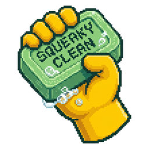

<p align="center">
  
</p>

<h1 align="center">Squeaky Clean</h1>

<p align="center">
  <strong>Clean-Architecture codegen.</strong>
  Pattern-specialized. Parallelized. Cost-tiered.
</p>

<p align="center">
  An opinionated, semi-deterministic agentic tool. One declarative
  <code>ProblemSpec</code> in, a buildable, testable application out. By
  capitalizing on the modularity of Clean Architecture, Squeaky orchestrates
  atomic agents in parallel across compact, low-parameter models.
</p>

<p align="center">
  <a href="https://opensource.org/licenses/Apache-2.0"></a>
</p>

---

## Why Squeaky Clean?

Small-parameter models frequently hallucinate, forcing engineers toward high-parameter alternatives where computational costs scale quadratically with context. Squeaky Clean is an opinionated, semi-deterministic agentic software development tool designed to break this cycle.

Squeaky Clean (or Squeaky) capitalizes on the modularity and granularity of Clean Architecture, SOLID principles, and GoF + DDD patterns. By doing so, it maximizes parallelization and wall-clock velocity while minimizing both the "hallucination blast radius" and operational costs.

The framework defines an Architectural DSL called **Squib** to orchestrate atomic, pattern-specialized agents that run efficiently on compact, low-parameter models. The Squib between tiers is a frozen, validated grammar (~200 chars per class, machine-checkable), ensuring the cheaper tier never has to guess what the more capable tier meant.

**Why "Clean."** Clean Architecture keeps software maintainable by holding details — the database, the web, the framework — at the edges. That same discipline has a second payoff as AI enters the loop: leaner compute. LLM inference cost grows super-linearly with context length (attention is O(n²)), and reaching for a higher-parameter model multiplies the curve. Because Clean Architecture decomposes a system into small, bounded contexts, each atomic agent sees one class and one pattern — a ~200-character Squib — so the overwhelming majority of token volume runs on compact models. Fewer tokens on smaller models means measurably lower cost per run today, and — proportionally — lower energy.

Reducing the ecological footprint of AI-assisted development is a goal this open-source project is building toward, not a figure it claims. We measure tokens and cost; energy is proportional to compute, so we speak of it proportionally — and we'll publish a monolithic-vs-Squeaky token ablation before quantifying further.

## Quick Start

**macOS / Linux**

```bash
# Install directly from GitHub
pip install git+https://github.com/garciaalan186/squeaky-clean.git

# Set your Anthropic API key
export ANTHROPIC_API_KEY="<your-key>"  # secret-scan: allow

# Generate a Todo API (smallest example)
squeaky generate --problem-file examples/todo_api/todo_problem.json --infra=auto
```

**Windows (PowerShell)**

```powershell
# Install directly from GitHub via py launcher
py -m pip install git+https://github.com/garciaalan186/squeaky-clean.git

# Set your Anthropic API key in PowerShell
$env:ANTHROPIC_API_KEY = "<your-key>"

# Generate a Todo API
squeaky generate --problem-file examples/todo_api/todo_problem.json --infra=auto
```

**Source (Dev)**

```bash
# Clone and install in editable mode
git clone https://github.com/garciaalan186/squeaky-clean.git
cd squeaky-clean
pip install -e ".[dev]"

# Set your Anthropic API key
export ANTHROPIC_API_KEY="<your-key>"  # secret-scan: allow
```

After generation, install the project's deps and run its tests:

```bash
cd <output_dir>
pip install -r requirements.txt --target .test-deps/
PYTHONPATH=.:.test-deps python -m pytest tests/ -q
```

## What's different

- **Clean Architecture, top to bottom.** SOLID, GoF, and DDD patterns are the shared vocabulary between agent tiers. The Dependency Rule is enforced by a real validator: domain imports nothing, application imports only domain, infrastructure implements domain ports. The framework's own source obeys every constraint it enforces on generated code.

- **Parallelized agents at compact-tier cost.** Architects emit a multi-MODULE plan via the DSL, deploying one pattern-specialized atomic agent per file. By routing the vast majority of token volume to compact models — and reserving the larger tier strictly for architectural decisions — the framework builds distributed architectures in a single, high-velocity, low-cost parallel sweep.

- **Cross-service contract fidelity.** Two services produce/consume the same Kafka topic? The Contract Registry enforces field-shape agreement across language boundaries with case-tolerant validation. The consumer's `ConsumedEvent` carries the producer's contract field names verbatim.

- **Bidirectional: generate *and* recover.** The same Clean-Architecture discipline runs in reverse. Point Squeaky at a brownfield Python/JS/TS/Java project and it recovers a faithful `Squib`, analyzes it for architecture violations, and (with your sign-off) refactors framework-coupled classes into Entity + Repository + Adapter before regenerating. See [Agentic Architecture Recovery](docs/architecture_recovery.md).

## Coverage matrix

| Category | Python | Java | Go | Rust | JS | TS |
|---|:---:|:---:|:---:|:---:|:---:|:---:|
| ddd_clean (Entity, ValueObject, SimpleClass, Strategy) | ✅ | ✅ | ✅ | ✅ | ✅ | ✅ |
| security agents (5 categories) | ✅ | ✅ | ✅ | ✅ | ⏳ | ⏳ |
| blob_storage | ✅ | ✅ | ✅ | ✅ | ✅ | ✅ |
| kv_cache | ✅ | ✅ | ✅ | ✅ | ✅ | ✅ |
| relational_db / document_db | ✅ | ✅ | ✅ | ✅ | ✅ | ✅ |
| message_queue (producer + consumer) | ✅ | ✅ | ✅ | ✅ | ✅ | ✅ |
| stream_processor | ✅ | ✅ | ✅ | ✅ | ✅ | ✅ |
| rest_client / rest_server_handler | ✅ | ✅ | ✅ | ✅ | ✅ | ✅ |
| grpc_client / grpc_server_handler | ✅ | ✅ | ✅ | ✅ | ✅ | ✅ |
| websocket_server_handler | ✅ | ✅ | ✅ | ✅ | ✅ | ✅ |
| observability_logger | ✅ | ✅ | ✅ | ✅ | ✅ | ✅ |
| secrets_provider | ✅ | ✅ | ✅ | ✅ | ✅ | ✅ |
| search | ✅ | ✅ | ✅ | ✅ | ✅ | ✅ |

`✅` = full Tier C atomic agent + ≥2 TechSpec snapshots + e2e build available. `⏳` = on the roadmap.

## Benchmarks & Meta-Evaluation

Squeaky includes a **meta-evaluation framework** to iteratively benchmark codegen performance against efficiency metrics, such as wall-clock velocity, cost, and artifact-token ratios.

Rather than relying on raw lines of code (LOC), it normalizes these metrics against a **composite architectural complexity score** that captures the structural, source (McCabe + Halstead), and constraint complexity of the output.

Every figure on the [Benchmarks page](https://docs.squeakyclean.ai/benchmarks/) traces to a specific run ID under `meta-evaluation-results/`.

## How it works (60 seconds)

```
ProblemSpec (JSON)
       │
       ▼
PrincipalArchitect ──► Squib ModuleSpec (text)
       │                   │
       │                   ▼
       │            ArchitectureSpec (multi-MODULE, validated DAG)
       │                   │
       │                   ▼
       │             OrchestrateArchitecture
       │                   │
       │            (parallel fan-out per module)
       │                   ▼
       │             ImplementClass × N (atomic agents)
       │                   │
       │                   ▼
       └────► IntegrateModule → src/ + tests/ + main.py + requirements.txt
                                                    │
                                                    ▼
                                          mvn / cargo / pytest / etc.
```

Three model tiers: Architect (high-parameter), Manager (mid), atomic agent (compact, lightly sampled, parallelized). Cost is dominated by the atomic-agent tier.

## Known gaps

- **TestArchitect verb hallucination.** When the architect's emitted Squib doesn't declare a verb the acceptance criteria reference, the generated test calls `pytest.fail("verb X not in ModuleSpec")` rather than inventing methods. K5's per-module criterion filtering bounds this; remaining residue is genuine impl/test mismatches.
- **Not a one-shot LLM call.** Squeaky orchestrates dozens of LLM calls per run, parallelized, with prompt caching and a strict per-tier cost budget.
- **Not a substitute for understanding your domain.** Garbage spec → garbage generation. The framework asks you to declare your bounded contexts and acceptance criteria.

## Agentic Architecture Recovery

Squeaky runs in **both directions**. Beyond generating from a `ProblemSpec`, it can point at an existing brownfield project and rebuild it as Clean Architecture — messy legacy code in, a freshly generated Clean-Architecture project out.

Recovery is a five-phase pipeline, each phase persisted and independently re-runnable:

```
--recover-from  ─►  --triage  ─►  --refactor  ─►  --squib-file
  Recover +           Triage         Refactor        Regenerate
  Analyze          (opt-out review)  (apply fixes)   (standard pipeline)
```

```bash
# Ingest a project → faithful Squib + categorized violations
squeaky --recover-from ./legacy-app --language python --recover-out out/recovered.squib \
        --criteria testability,evolvability,simplicity,performance,migration_safety,delivery_speed
# Opt-out review of the findings → a refactor plan
squeaky --triage out/recovered.squib.violations.json
# Apply the accepted fixes (framework-coupled classes → Entity + Repository + Adapter)
squeaky --refactor out/recovered.squib --plan out/refactor_plan.json --refactor-out out/refactored.squib
# Feed the signed-off Squib back into generation
squeaky --squib-file out/refactored.squib --legacy-tests ./legacy-app/tests
```

- **Faithful recovery.** The recovered Squib is a true photograph of the original — coupling and all. Judgment (Analyze) and fixing (Refactor) are separate, opt-in phases.
- **Framework-agnostic violation analysis.** A generic detector flags domain classes welded to a foreign base (ORM models, Active Record) by allowlisting the language *standard library*, not indexing every framework. Plus dependency-rule, cyclic-dependency, granularity, and decorative-class categories.
- **Priorities-driven refactoring.** You rank shared architectural criteria (`--criteria`); a weighted MCDA decides *preserve* vs *split* per coupled class, with hard invariants as non-negotiable gates.
- **Four-language ingest.** `--language {python,javascript,typescript,java}` — Python via a real AST walk, JS/TS/Java via regex extractors (lower fidelity, documented). Go/Rust follow.

Full guide: [Agentic Architecture Recovery](docs/architecture_recovery.md). Tracked as Milestones **L / M / N** on the [roadmap](docs/roadmap.md).

## Examples

- [`examples/todo_api/`](examples/todo_api/) — smallest end-to-end (Flask Todo REST API)
- [`examples/twitter_clone/`](examples/twitter_clone/) — multi-context with rich domain semantics
- [`examples/event_pipeline/`](examples/event_pipeline/) — distributed two-service Kafka pipeline (cross-service contract fidelity)

## Documentation

Docs live at <https://docs.squeakyclean.ai>. Highlights:

- **Why Squeaky Clean?** — design philosophy + 5-minute pitch.
- **Architecture deep-dive** — three tiers + agent hierarchy.
- **Squib grammar** — the inter-tier instruction set.
- **Author your first ProblemSpec** — walkthrough + best practices.
- **Custom patterns** — extension hook + custom Tier C agents.
- **Agentic Architecture Recovery** — the inverse path: brownfield code → recovered `Squib` → refactor → regenerate.
- **Infrastructure layer design** — full design doc.
- **Benchmarks** — methodology + measured run data.
- **Roadmap** — public, milestone-level.

## Contributing

See [`CONTRIBUTING.md`](CONTRIBUTING.md). The framework eats its own dog food: every Hard Rule it enforces on generated code applies to its own source. PRs welcome on RFCs (12 open design questions in `docs/infrastructure_layer_design.md` §10).

## License

[Apache 2.0](LICENSE). You own what you generate. Anthropic's IP terms apply to LLM output.

## Project status

**Active development.** 60 Tier C atomic agents across 15 infrastructure categories; six target languages. Pre-launch milestone (Milestone K) complete. Agentic Architecture Recovery (Milestones L / M / N) — the brownfield-in, Clean-Architecture-out inverse pipeline — landed with four-language ingest. Looking for early users with real ProblemSpecs and brownfield projects.
